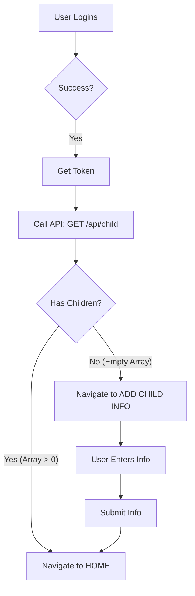

# 👶 توثيق تدفق إنشاء بيانات الطفل (Child Onboarding Flow)

هذا المستند يشرح كيفية تنفيذ ميزة التحقق من وجود أطفال للمستخدم، وتوجيهه إلى الصفحة المناسبة (إما صفحة إضافة طفل أو الصفحة الرئيسية) بناءً على ذلك.

## 🎯 الهدف
عندما يقوم المستخدم (الأب/الأم) بتسجيل الدخول:
1. إذا **كان لديه أطفال بالفعل** المسجلين في النظام -> تفتح له **الصفحة الرئيسية (Home)** مباشرة.
2. إذا **لم يكن لديه أي طفل** (حساب جديد) -> تفتح له **صفحة إضافة بيانات الطفل** (الاسم والعمر).

---

## 🛠️ كيف تعمل الميزة (Logic Flow)

### 1. أثناء تسجيل الدخول (Login)
عند نجاح عملية تسجيل الدخول والحصول على الـ `Token`، يجب القيام بخطوة إضافية قبل التوجيه:
- استدعاء API المسمى `getMyChildren` (الذي قمنا بإنشائه في الباكإند).
- فحص نتيجة الـ API:
  - هل المصفوفة `children` فارغة `[]`؟
  - هل المصفوفة تحتوي على بيانات؟

### 2. اتخاذ القرار (Decision Making)
- **الحالة أ (يوجد أطفال)**:
  - تخزين حالة في التطبيق (مثلاً `hasChildren: true`).
  - التوجيه فوراً إلى `/home`.
- **الحالة ب (لا يوجد أطفال)**:
  - تخزين حالة `hasChildren: false`.
  - التوجيه إلى صفحة `/add-child` (أو الصفحة المخصصة لإدخال بيانات الطفل).

---

## 💻 خطوات التنفيذ المقترحة (Implementation Considerations)

### 🧩 1. تعديل خدمة الـ API
تأكد من وجود دالة في الفرونت إند لاستدعاء الباكإند:
```typescript
// frontend/src/services/childApi.ts
import { request } from "./request";

export const getMyChildren = () => request("/child/all/me", "GET");
/* ملاحظة: تأكد من المسار الصحيح في الباكإند، 
قد تحتاج لتعديل الباكإند ليكون /api/child فقط لجلب أطفال المستخدم الحالي دون تمرير ID */
```

### ⚛️ 2. تحديث `AuthContext` أو `LoginScreen`
في صفحة تسجيل الدخول `LoginScreen.tsx`، بعد استلام التوكن:

```typescript
const handleLoginSuccess = async (token) => {
  // 1. حفظ التوكن
  saveToken(token);

  // 2. فحص الأطفال
  try {
    const children = await getMyChildren();
    
    if (children && children.length > 0) {
       // لديه أطفال -> الصفحة الرئيسية
       navigate("/home");
    } else {
       // ليس لديه أطفال -> صفحة إضافة طفل
       navigate("/add-child-info");
    }
  } catch (error) {
    console.error("Failed to fetch children", error);
    // في حالة الخطأ، يمكن التوجيه للرئيسية كخيار افتراضي
    navigate("/home");
  }
};
```

### 🛡️ 3. حماية المسارات (Route Guards)
- **صفحة إضافة الطفل (`/add-child-info`)**:
  - يفضل ألا يدخلها المستخدم إذا كان لديه أطفال بالفعل (إلا إذا كان يريد "إضافة طفل جديد" زر منفصل).
  - يمكن إضافة تحقق عند فتح الصفحة: "إذا كان لديه أطفال، هل هو قادم من زر 'إضافة طفل' أم أنه توجيه تلقائي؟"

---

## 🔄 ملخص التدفق (Diagram)



---
